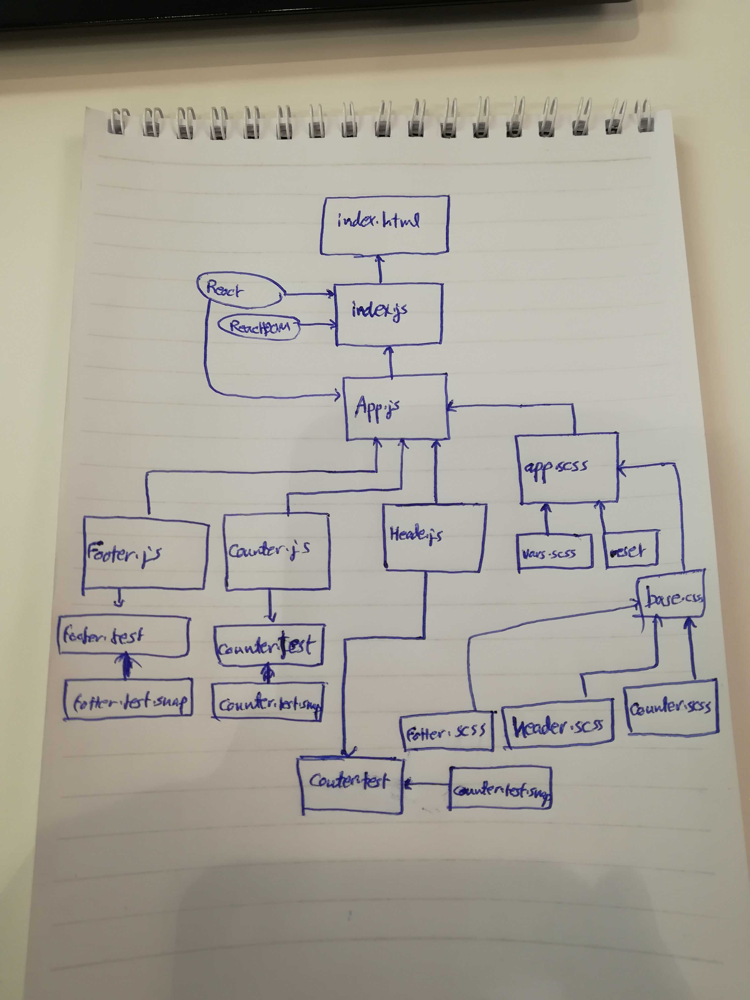

# LAB - Class 27

## React testing And Deployment

### Author: Ahmad K. Al-Mahasneh

### Links and Resources

- [submission PR](https://github.com/401-advanced-javascript-AhmadK/react-testinganddeployment/pull/1)
- [ci/cd](https://github.com/401-advanced-javascript-AhmadK/react-testinganddeployment/actions) (GitHub Actions)
- [gh-pages](https://401-advanced-javascript-ahmadk.github.io/react-testinganddeployment/)
- [netlify](https://elated-kepler-69b938.netlify.com)

#### How to initialize/run your application (where applicable)

- `npm run build`
- `npm run start`

#### Tests

- snapshot tests 

#### UML

